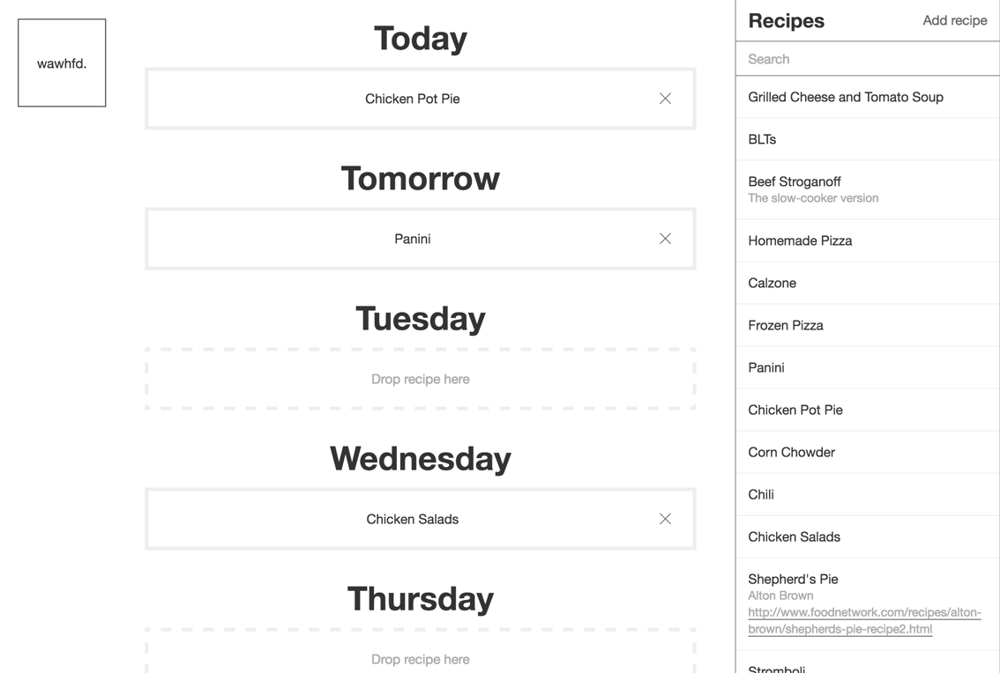

# What are we having for dinner? (Wawhfd)

My wife and I have a hard time planning what to have to dinner. I created a little Django/React app to help us out. I wanted a place where we could save meals and recipes and then assign them to one of the next several days.

Basically, you fill the sidebar with recipes and/or meals, and then drag and drop them onto days.

#### Amazing features!
- Add new recipes
- Edit existing recipes
- Delete recipes you never want to eat again
- Search for recipes

## Setup

Note, Wawhfd uses Python 3 and (virtualenv)[https://virtualenv.pypa.io/en/stable/].

1. Clone the repo: `git clone git@github.com:calebrash/wawhfd.git && cd wawhfd`
2. Create a virtualenv: `mkvirtualenv -ppython3 wawhfd`
3. Create a database: `psql -c 'CREATE DATABASE wawhfd'`
4. Build everything: `make build`
5. Run migrations: `make migrate`
6. Run everything: `make server`

Want to make changes? You'll need to install webpack (`npm install -g webpack`) and then run `make dev` to build static files.
